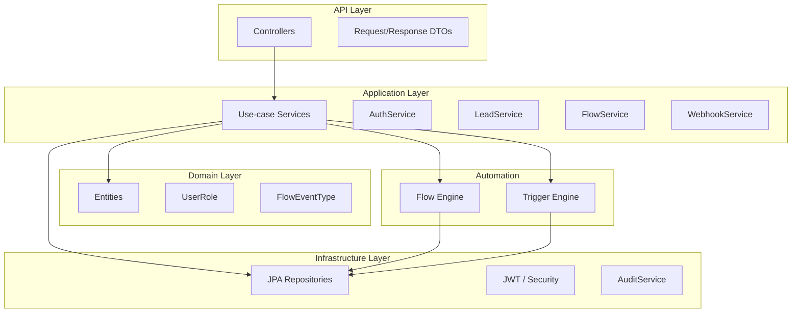
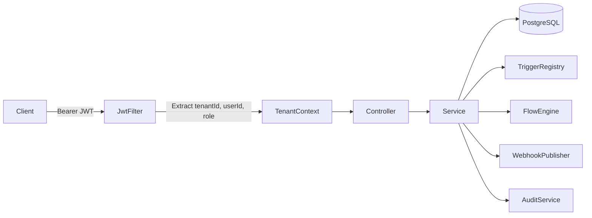
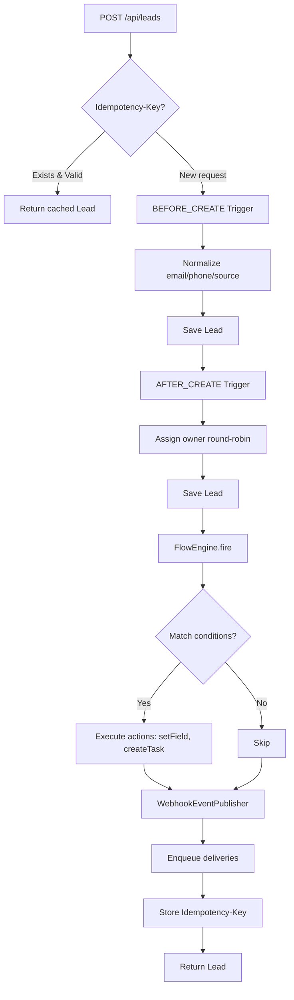
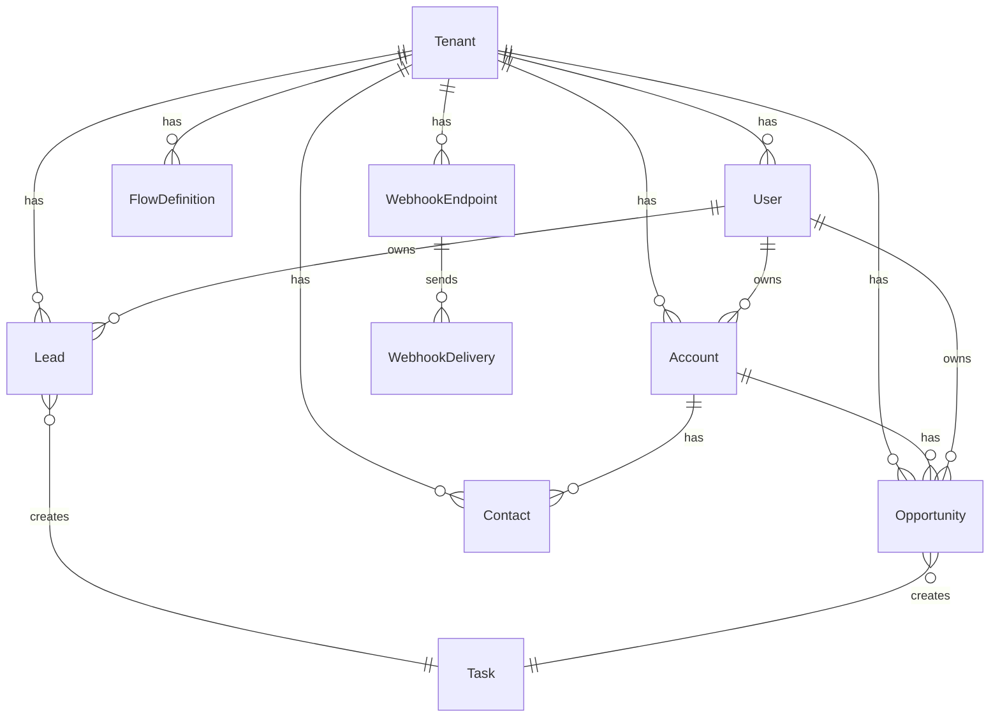
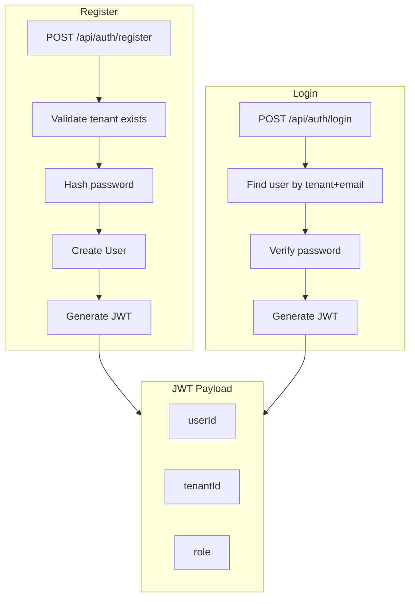
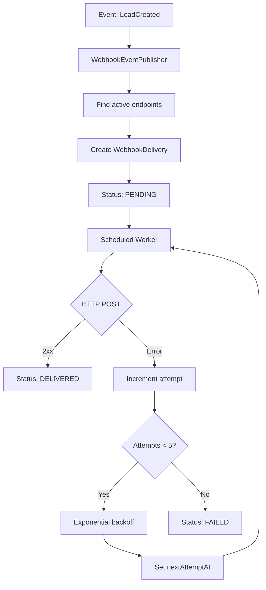

# CRM Automation Platform

A production-style, Salesforce-inspired CRM backend built with Java and Spring Boot. Features a multi-tenant architecture, JWT authentication, an automation engine (Triggers + Flows), outbound webhooks with retry logic, and comprehensive audit logging.

---

## Table of Contents

- [Overview](#overview)
- [Architecture](#architecture)
- [Tech Stack](#tech-stack)
- [Data Model](#data-model)
- [Key Features](#key-features)
- [API Reference](#api-reference)
- [Getting Started](#getting-started)
- [Environment Variables](#environment-variables)

---

## Overview

This project demonstrates enterprise-grade backend development patterns:

- **Multi-tenant SaaS** — Every record is scoped by `tenant_id`; no cross-tenant data access
- **Automation Engine** — Triggers (before/after create/update) and Flows (rule-based pipelines stored as JSON)
- **Reliability** — Optimistic locking, idempotency keys, webhook retries with exponential backoff
- **Governance** — Role-based access (ADMIN, SALES, SUPPORT), field-level masking, audit logs

---

## Architecture

### Layered Structure (Clean Architecture + DDD-inspired)



### Request Flow (Authenticated API Call)



### Lead Creation Flow (End-to-End)



### Entity Relationships



### Authentication Flow



### Webhook Delivery & Retry



---

## Tech Stack

| Category | Technology |
|----------|------------|
| **Language** | Java 21 |
| **Framework** | Spring Boot 3.3+ |
| **Build** | Maven |
| **Database** | PostgreSQL |
| **ORM** | Spring Data JPA (Hibernate) |
| **Migrations** | Flyway |
| **Security** | Spring Security, JWT (jjwt) |
| **Validation** | Jakarta Validation |
| **API Docs** | SpringDoc OpenAPI (Swagger) |
| **Testing** | JUnit 5, Testcontainers (PostgreSQL) |
| **Observability** | Spring Boot Actuator |

---

## Data Model

| Entity | Description |
|--------|-------------|
| **Tenant** | Top-level isolation; all data scoped by `tenant_id` |
| **User** | Per-tenant users with roles: ADMIN, SALES, SUPPORT |
| **Account** | Company/organization record |
| **Contact** | Person linked to Account; `personalNumber` masked for SALES |
| **Lead** | Prospect; triggers normalize data, flows set score, create tasks |
| **Opportunity** | Sales deal with stage, amount, close date |
| **Task** | Follow-up item linked to Lead or Opportunity |
| **FlowDefinition** | Automation rule (JSON DSL: conditions + actions) |
| **WebhookEndpoint** | Tenant-registered URL for event delivery |
| **WebhookDelivery** | Delivery record with retry tracking, idempotency key |
| **IdempotencyKey** | Prevents duplicate creates (e.g., lead with same key) |
| **AuditLog** | Who/when/what changed (before/after JSON) |

---

## Key Features

### 1. Triggers (In-Process, Same Transaction)

- **BEFORE_CREATE** — Modify entity before persist (e.g., normalize email, phone, source)
- **AFTER_CREATE** — Post-persist logic (e.g., assign owner via round-robin)
- Handlers are Java classes; run inside the same DB transaction

### 2. Flows (Rule-Based Automation)

- Stored in DB as JSON
- **Conditions**: `equals`, `contains`, `greaterThan`, `lessThan`, `isEmpty`
- **Actions**: `setField`, `createTask`, `sendWebhook`
- Fired on events (e.g., `LEAD.CREATED`)

### 3. Webhooks

- Tenant registers URL; events (e.g., LeadCreated) POST to it
- Retries with exponential backoff (up to 5 attempts)
- Idempotency key per delivery to avoid duplicates
- Status: PENDING → DELIVERED or FAILED

### 4. Security & Governance

- **Roles**: ADMIN (full), SALES (CRUD except delete), SUPPORT (read-heavy)
- **Field masking**: SALES cannot see `Contact.personalNumber`
- **Audit**: AOP logs CREATE/UPDATE with before/after JSON

### 5. Reliability

- **Optimistic locking** (`@Version`) on mutable entities
- **Idempotency-Key** header on lead create
- **RFC 7807**-style Problem Details for errors

---

## API Reference

### Auth

| Method | Endpoint | Description |
|--------|----------|-------------|
| POST | `/api/auth/register` | Register user (tenantId, email, password, role) |
| POST | `/api/auth/login` | Login → JWT (tenantId, userId, role) |

### CRM

| Method | Endpoint | Description |
|--------|----------|-------------|
| CRUD | `/api/accounts` | Account management |
| CRUD | `/api/contacts` | Contact management |
| CRUD | `/api/leads` | Lead management (supports `Idempotency-Key`) |
| GET | `/api/leads?status=&owner=&q=` | Filter by status, owner, search |
| CRUD | `/api/opportunities` | Opportunity management |

### Automation

| Method | Endpoint | Description |
|--------|----------|-------------|
| POST | `/api/flows` | Create flow |
| PUT | `/api/flows/{id}` | Update flow |
| POST | `/api/flows/{id}/activate` | Activate flow |
| POST | `/api/flows/{id}/deactivate` | Deactivate flow |
| GET | `/api/flows?eventType=` | List flows |

### Webhooks

| Method | Endpoint | Description |
|--------|----------|-------------|
| POST | `/api/webhooks` | Register webhook endpoint |
| GET | `/api/webhooks` | List endpoints |
| GET | `/api/webhook-deliveries?status=` | List deliveries |

### Observability

| Method | Endpoint | Description |
|--------|----------|-------------|
| GET | `/actuator/health` | Health check |
| GET | `/swagger-ui.html` | OpenAPI UI |

---

## Getting Started

### Prerequisites

- Java 21+
- Maven 3.9+
- Docker (for PostgreSQL or Testcontainers)

### Run PostgreSQL

```bash
docker compose up -d
```

### Run the Application

```bash
mvn spring-boot:run
```

### Run Tests

```bash
mvn test
```

### Verify with curl

```bash
# 1. Register
curl -X POST http://localhost:8080/api/auth/register \
  -H "Content-Type: application/json" \
  -d '{"tenantId":"11111111-1111-1111-1111-111111111111","email":"admin@demo.com","password":"password123","role":"ADMIN"}'

# 2. Login
TOKEN=$(curl -s -X POST http://localhost:8080/api/auth/login \
  -H "Content-Type: application/json" \
  -d '{"tenantId":"11111111-1111-1111-1111-111111111111","email":"admin@demo.com","password":"password123"}' | jq -r '.token')

# 3. Create lead with Idempotency-Key
curl -X POST http://localhost:8080/api/leads \
  -H "Authorization: Bearer $TOKEN" \
  -H "Content-Type: application/json" \
  -H "Idempotency-Key: my-unique-key-123" \
  -d '{"firstName":"John","lastName":"Doe","email":"john@example.com","phone":"+1-555-123-4567","source":"website"}'

# 4. Create & activate flow
curl -X POST http://localhost:8080/api/flows \
  -H "Authorization: Bearer $TOKEN" \
  -H "Content-Type: application/json" \
  -d '{"eventType":"LEAD.CREATED","name":"Score Flow","jsonDefinition":{"conditions":[{"field":"source","operator":"equals","value":"WEBSITE"}],"actions":[{"type":"setField","field":"score","value":10},{"type":"createTask","title":"Follow up","relatedType":"Lead"}]}}'

# 5. Register webhook
curl -X POST http://localhost:8080/api/webhooks \
  -H "Authorization: Bearer $TOKEN" \
  -H "Content-Type: application/json" \
  -d '{"url":"https://httpbin.org/post","secret":"whsec"}'

# 6. Check webhook deliveries
curl http://localhost:8080/api/webhook-deliveries?status=PENDING -H "Authorization: Bearer $TOKEN"
```

---

## Environment Variables

| Variable | Default | Description |
|----------|---------|-------------|
| DB_HOST | localhost | PostgreSQL host |
| DB_PORT | 5432 | PostgreSQL port |
| DB_NAME | crm | Database name |
| DB_USER | crm_user | Database user |
| DB_PASSWORD | crm_password | Database password |
| SERVER_PORT | 8080 | Application port |
| JWT_SECRET | (in application.yml) | JWT signing key (min 256 bits) |
| JWT_EXPIRATION_MS | 86400000 | Token expiry (24h) |

---

## Project Structure

```
src/main/java/com/shotaroi/crm/
├── api/              # Controllers, DTOs
├── application/      # Use-case services
├── automation/       # Trigger engine, Flow engine
├── common/           # TenantContext, Audit, errors
├── domain/           # Entities, UserRole
├── infrastructure/   # Repositories, JWT, Security
└── integration/     # Webhook delivery worker
```
